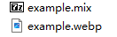

# 奥奇传说页游解包脚本

## 主要功能
- **解压mix**:提取脚本所在文件夹下的*mix*文件 
- **修改atlas和webp**:使文件可被spine软件使用 
- **拆分图集**:根据atlas拆分png 

## 需要的环境
- Python3 Pillow  
- **解压软件7z**:脚本unmix.py第5行指定了7z的位置,可根据情况自行修改

## 使用方法
### 安装模块
```bash
pip install -r requirements.txt
```
### 需要的文件
- mix文件(或准备好的atlas文件)  
- **与atlas对应**的webp图片(或准备好的png图片)对webp图片名字没有要求  
*mix文件和webp可在H5版本的页游网站上,通过开发人员工具(F12)对网络资源捕捉得到* 
- 均放在脚本文件同目录下  
  
***<font color="red">默认配置下只支持一个mix(或atlas)和一个webp对应,暂不支持多webp</font>***  
***<font color="red">脚本同文件夹下不应放无关的mix,atlas或webp文件</font>***
### 使用

情况1.**解压mix+修改atlas和webp+拆分png**
```bash
python start.py
```
情况2.**只解压mix**
```bash
python unmix.py
```
情况3.**只拆分png**
```bash
python unpack.py
```

## 致谢
 - [unpack_atlas](https://github.com/foxsugar/unpack_atlas) 拆分图集功能


## 许可证
- [MIT](LICENSE)